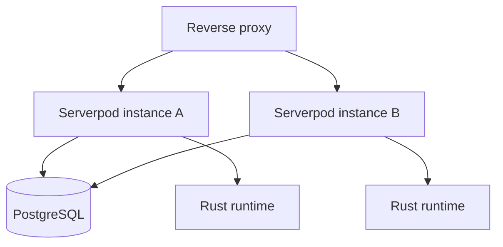
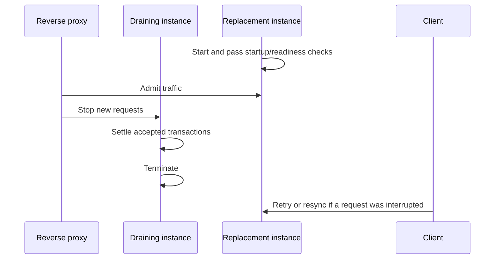

# Multiplayer scale-out

Game requests are stateless at the API process boundary. PostgreSQL stores the
canonical Rust state and every durable game record; each Serverpod instance
loads the locked match row, invokes the same Rust runtime, and commits the
result in one transaction.

## Runtime contract

- Route traffic only to instances whose `/readyz` returns `200`.
- Use `/livez` for process health and `/startupz` for startup completion.
- Deploy the exact same Dart, Rust, protocol, map, and ruleset artifacts to
  every active instance.
- Run schema application as a dedicated deployment step before admitting
  traffic to the new artifact.
- Keep the API private behind the reverse proxy and replace untrusted client-IP
  headers before authentication rate limiting.
- Recover an interrupted request with `resync`; no process-local subscription
  registry or canonical client replay is required.

Row locking and the command ledger serialize concurrent mutations for one match.
Different matches can execute concurrently on different instances. Retrying an
accepted request with the same command id and payload returns its stored outcome;
reusing the id for another payload is rejected.

## Rolling deployment

A rolling deployment must not mix artifacts with different protocol or content
identity. If that cannot be guaranteed, drain every old instance before the new
artifact receives game traffic.

The deployment-image and readiness contract is recorded in
[ADR 0005](adr/0005-immutable-deployment.md).
