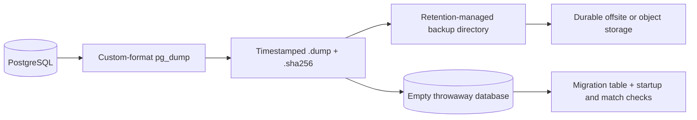
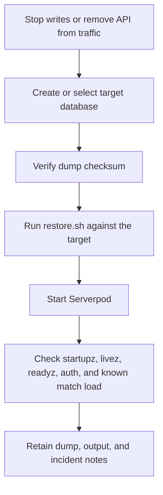

# PostgreSQL backup and restore

Docker volumes are not backups. Production and shared staging data need custom-format `pg_dump` files on durable storage and a regular restore test.



## Create a backup

```sh
DATABASE_URL="$AONW_PRODUCTION_DATABASE_URL" \
AONW_BACKUP_DIR=/var/backups/aonw/postgres \
AONW_BACKUP_RETENTION_DAYS=14 \
deploy/postgres/backup.sh
```

The script writes a timestamped `.dump` and matching `.sha256` file, then removes local files older than the configured retention period.

Do not keep the only copy on the same host or disk as PostgreSQL. Sync the backup directory to durable offsite or object storage.

## Test a restore

At least once per release, restore the newest dump into an empty throwaway database:

```sh
latest="$(ls -1t /var/backups/aonw/postgres/aonw-*.dump | head -1)"
AONW_RESTORE_DATABASE_URL="$AONW_EMPTY_RESTORE_DATABASE_URL" \
  deploy/postgres/restore.sh "$latest"
```

The restore script refuses to target `DATABASE_URL` unless `AONW_RESTORE_ALLOW_PROD=true` is set. It verifies that the Serverpod migration table is readable after restore.

## Incident restore



1. Stop application writes or remove the API from traffic.
2. Create or select the target database.
3. Verify the dump checksum.
4. Run `deploy/postgres/restore.sh <backup.dump>` with `AONW_RESTORE_DATABASE_URL` pointing to the target.
5. Start the server and check `/startupz`, `/livez`, `/readyz`, authentication, and a known match load.
6. Keep the dump, command output, and incident notes until recovery is closed.

Never overwrite production during a restore test.
