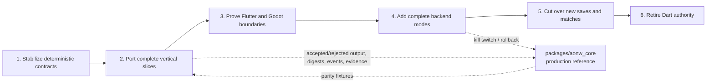
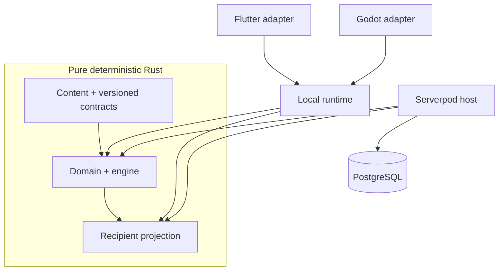

# Rust engine migration

- Status: active strangler migration
- Governing decision: [ADR 0008](adr/0008-rust-engine-ownership-and-strangler-migration.md)
- Production authority today: `packages/aonw_core`
- Successor implementation: `engine/`

Age of New Worlds is moving authoritative gameplay rules from Dart to Rust so the same engine can serve Flutter, Godot, AI, replay, and Serverpod. This is a compatibility port, not a gameplay rewrite.



## Current checkpoint

The Rust workspace has a working vertical slice for strict content, canonical state, movement queries and transitions, fog, diplomacy, cities, roads, save/replay contracts, local runtime sessions, recipient-safe patches, initial unit actions, and thin Godot/Flutter native adapters.

The shared fixture corpus covers the current movement and unit-action slice. Godot can open a Rust local session, query reachable tiles, execute movement, and consume exact movement evidence.

This does **not** make Rust the production backend. Flutter local play and Serverpod still use the Dart engine by default. The next work must continue through complete command families and turn-driven behavior rather than introducing client-specific rules.

The current crate inventory and commands are documented in [`../engine/README.md`](../engine/README.md).

## Rules that do not change during migration

1. The Flutter application stays buildable and releasable at the repository root.
2. `packages/aonw_core` remains the compatibility reference until explicit cutover gates pass.
3. Port current behavior before redesigning it.
4. One save or match uses one primary engine for its entire lifetime.
5. Command families are never split between Dart and Rust inside an active session.
6. Fixtures are an independently reviewed oracle. Neither implementation may generate and bless its own expected result in CI.
7. Flutter, Godot, bridge code, and Serverpod endpoints do not own movement, combat, economy, fog, AI, or save rules.
8. Public protocol and durable schema changes follow their existing compatibility process; a language port does not imply a version bump.

## Target ownership



| Component | Responsibility |
| --- | --- |
| Rust domain and engine | Pure deterministic state transitions and queries. No I/O, framework, clock, localization, or database dependencies. |
| Rust content/contracts | Strict versioned maps, scenarios, state, save, replay, and client protocol models. |
| Local runtime | Session lifecycle, revision checks, command/query dispatch, recipient snapshots, and view patches. |
| Flutter/Godot adapters | Marshal the shared client protocol and render recipient-safe results. |
| Serverpod | Authentication, lobby/match lifecycle, locking, transactions, persistence, offsets, post-commit delivery, and reconnect. |
| PostgreSQL | Durable online source of truth. |

Recipient projection is a rules-sensitive policy and belongs with the engine. A remote client never reconstructs canonical `DomainState` from projected data.

## Migration sequence

### 1. Stabilize contracts

Keep the Dart engine boundary deterministic and explicit. Every external rule input must be carried in state, command, or context. Presentation effects stay outside authoritative results.

### 2. Port complete vertical slices

For each slice:

- read all supported current inputs;
- produce the same accepted/rejected result, state digest, events, evidence, and RNG position;
- cover round trips and rejection-without-mutation;
- keep the Dart path releasable;
- add a measured performance case when the slice is performance-sensitive.

Do not create empty crates for planned responsibilities. Add a crate when its first behavior and tests are ready.

### 3. Prove native client boundaries

Godot and Flutter consume the same coarse, versioned client protocol. Raw canonical state does not cross the client boundary. Native panics are contained in the adapter and reported as stable errors.

Required checks:

```sh
make rust-check
make rust-flutter-test
make godot-check
```

### 4. Add complete backend modes

The rollout model needs complete-engine selections such as:

- Dart only;
- Dart primary with Rust shadow;
- Rust primary with Dart shadow;
- Rust primary with Dart standby;
- Rust only.

Shadow output is comparison data only. It is never persisted, broadcast, or shown as authoritative.

### 5. Cut over new work

A kill switch may change the default engine for new saves or matches after parity, packaging, observability, and rollback drills pass. Existing work remains pinned unless an explicit versioned migration proves it safe to move.

Readers come before writers: Rust may write a format only when every supported Rust input is readable and the rollback Dart path can read the new output.

### 6. Retire Dart authority

The Dart engine can be removed only when all of the following use Rust:

- every player and system command;
- queries and legality previews;
- turn processing, AI, and simulation;
- canonical saves and replay;
- recipient projection;
- Flutter and Godot local sessions;
- Serverpod authoritative transitions and recovery;
- every supported platform, including a deliberate Flutter Web solution.

No active server match may remain pinned to Dart. Historical formats need a Rust reader/upcaster or an explicit end-of-support migration. The rollback window and drills must be complete.

Only after retirement should the repository be reorganized mechanically into final client/service directories. Do not mix that move with behavior migration.

## Verification and fixtures

The reviewed parity corpus lives under `test/fixtures/`. Candidate regeneration is a review aid, not an approval mechanism:

```sh
make rust-engine-oracle
```

A slice is complete only when Dart and Rust agree on full envelopes, not just the visible destination or a subset of fields.

Run Rust performance diagnostics separately:

```sh
make rust-benchmark
```

Wall-clock numbers are host-local observations. Stable signatures and work counters are the regression evidence.

## Known transitional boundaries

- Flutter network state is recipient-projected by Serverpod but still passes through a Dart canonical compatibility envelope. Replace it with nominal recipient types before remote-replica cutover.
- The Rust client/save/replay contracts are current-only. Historical upcasters are deferred until a second schema exists.
- Rust is not yet the Serverpod production engine or the default Flutter local engine.

Keep this page at milestone level. Detailed crate behavior belongs in `engine/README.md`, Godot authoring behavior in `clients/aonw2_godot/README.md`, and durable decisions in ADRs.
