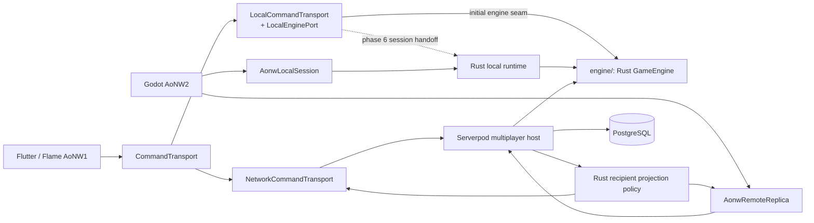
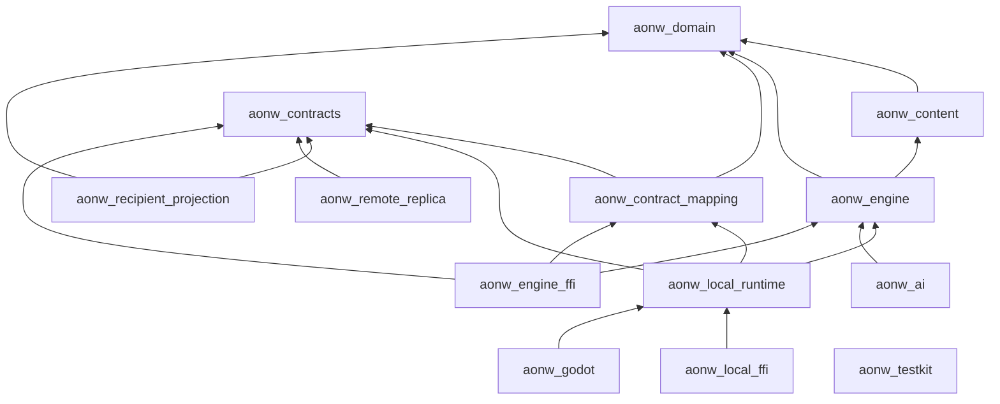

# Rust Engine Migration Plan

- Status: Target architecture and living migration plan
- Last updated: 2026-08-13
- Implementation checkpoint: phase 2/3 foundation started under `engine/`;
  production integration and rule-family parity have not started
- Governing decision: [ADR 0008](adr/0008-rust-engine-ownership-and-strangler-migration.md)

## Purpose

Age of New Worlds will migrate its authoritative game rules from the Dart
package `packages/aonw_core` to a shared Rust engine. The migration is an
incremental compatibility port, not a gameplay rewrite.

The Rust workspace will live in `engine/` from its first commit. The name
describes its product responsibility: deterministic game simulation and the
runtime adapters around it. It does not contain the Flutter or Godot clients.

The intended result is:

- one Rust implementation of authoritative rules for local play, AI, replay,
  Serverpod matches, Flutter, and the Godot AoNW2 client;
- a Flutter AoNW1 client that remains fixable, buildable, releasable, and fully
  functional during the complete migration;
- a Godot AoNW2 client that presents the same rules through a separate 3D user
  experience;
- Serverpod remaining responsible for authentication, lobby and match
  coordination, transaction ownership, persistence, offsets, post-commit
  delivery, and reconnect; a durable outbox is a separate target capability;
- retirement of the Dart rules implementation only after compatibility,
  rollback, platform, and release gates have all passed.

## Non-Negotiable Migration Rules

1. The existing Flutter project remains at the repository root during the
   migration. Moving it to `clients/aonw_flutter/` is a final mechanical cleanup,
   not an early architectural step.
2. `packages/aonw_core` remains the production implementation and compatibility
   reference until an explicit target-by-target cutover.
3. Rust first reproduces current behavior. Rust-native domain refactoring and
   intentional rule changes happen only after parity for the affected slice.
4. A production session or multiplayer match uses one primary engine backend
   for its entire lifetime. Command families are never split between Dart and
   Rust inside one live session.
5. The committed parity fixtures are an independently reviewed oracle. Neither
   Dart nor Rust may generate and bless its own expected results in CI.
6. Flutter and Godot contain presentation and interaction logic, not alternate
   movement, combat, economy, fog-of-war, AI, or save rules.
7. The main branch remains releasable. A critical Flutter fix does not wait for
   completion of the Rust port.

## Target Topology

Today `packages/aonw_core` owns canonical state, rules, protocol models, and AI.
The root Flutter application and Serverpod both depend on it. The migration
inserts stable ports around that existing engine before replacing its
implementation.

In the target architecture, local authority and a recipient-scoped remote
replica are separate seams. A remote client never receives or reconstructs
canonical `DomainState`.

The current Flutter network path is a known transitional exception to the
nominal type boundary. Serverpod already projects recipient-scoped wire state
in `PlayerMatchSnapshotProjector`, but `NetworkGameRepository` and
`SnapshotCodec` decode that safe payload through `CanonicalGameSnapshot` to
satisfy the shared `GameRepository` interface. This compatibility envelope
does not make Flutter authoritative, but it must be replaced by a dedicated
recipient snapshot/replica contract before the remote-replica cutover gate can
pass.



An in-process stateless Rust adapter is the preferred initial Serverpod
hypothesis, but is adopted only after the ABI, concurrency, packaging, resource,
and transaction-budget gates in phase 2 pass. A remote engine sidecar is not
part of the initial design; it would add a network failure boundary inside the
match transaction and requires separate evidence for crash isolation or scaling
benefits.

## Verified Current Migration Baseline

The migration seams below were checked against the current implementation. They
are the baseline to preserve, not claims that a Rust backend already exists:

| Area | Current implementation | Migration implication |
| --- | --- | --- |
| Flutter dispatch | The composition root selects `LocalCommandTransport` or `NetworkCommandTransport` behind `CommandTransport` for a complete dispatch path. | Keep this top-level boundary; add Rust below the local transport. |
| Local orchestration | `LocalCommandTransport` owns repository load/save, event-log append, snapshot cadence, clock use, and local resolution. | Introduce a narrow deterministic `LocalEnginePort` first; move full local-session ownership only in phase 6. |
| Dart engine | `GameEngine.apply` accepts `CanonicalGameSnapshot`, dispatches 11 command families, and returns a snapshot envelope plus movement and combat presentation facts. | Phase 1 must isolate `DomainState -> DomainTransition` and move presentation projection outside the engine before parity porting. |
| Network ACK handling | `NetworkCommandTransport` rebuilds authoritative client state from the server snapshot; its local reducer path only cleans up ephemeral interaction state after an accepted ACK. | Do not treat this presentation reconciliation as a second authoritative engine. |
| Server transaction | `MatchCommandService` persists inside the transaction and delivers its notification plan after commit. | Preserve transaction ownership; a durable outbox remains a separate future change. |
| Recipient projection | `PlayerMatchSnapshotProjector` filters state for one participant before transport, while the Flutter codec still uses the canonical compatibility envelope described above. | Preserve server-side redaction and replace the client envelope with nominal recipient types before remote-replica cutover. |

## Repository Layout During Migration

Existing Flutter, platform, Serverpod, asset, and fixture paths stay in place.
New Rust and Godot work is added alongside them:

```text
aonw/
├── lib/                            # existing Flutter AoNW1 client
├── test/
│   └── fixtures/
│       └── reducer_parity/         # shared independent slice oracle
├── assets/
├── android/ ios/ macos/ linux/ windows/ web/
├── pubspec.yaml
│
├── packages/
│   ├── aonw_core/                  # existing Dart engine during migration
│   ├── aonw_server_client/
│   └── aonw_native_bridge/         # future Dart wrapper over native ABIs
│
├── server/                         # Serverpod multiplayer/application host
│
├── engine/                         # Rust Cargo workspace
│   ├── README.md
│   ├── Cargo.toml
│   ├── Cargo.lock
│   ├── rust-toolchain.toml
│   ├── rustfmt.toml
│   └── crates/
│       ├── aonw_domain/
│       ├── aonw_content/
│       ├── aonw_engine/
│       ├── aonw_contracts/
│       ├── aonw_contract_mapping/
│       └── aonw_testkit/
│
├── clients/
│   ├── aonw_flutter/
│   │   └── README.md               # target boundary; active app stays at root
│   └── aonw2_godot/
│       ├── application/
│       ├── domain/
│       ├── infrastructure/
│       ├── presentation/
│       ├── project.godot
│       ├── scenes/
│       ├── tests/
│       └── README.md               # textured shared-map 3D preview
│
├── content/
│   ├── maps/                       # versioned shared logical maps
│   └── schemas/
│
├── docs/
├── deploy/
├── tool/
└── Makefile
```

The implemented phase 2/3 foundation includes the Rust workspace, testkit,
versioned logical map content, and the first Godot 3D map preview.
`aonw_native_bridge` and top-level contract publication remain planned.
Additional crates shown in the target layout below are created with their first
behavior and tests rather than as empty packages. No FFI, GDExtension, local
runtime, AI, or recipient-replica crate exists yet.

The parity fixtures are not copied into `engine/`. Both implementations read
the same committed corpus. New shared maps use the versioned `content/` root;
existing Flutter maps remain under `assets/maps/` and load through an explicit
Rust legacy adapter. Client-specific graphics and audio remain with clients.

After Dart Core retirement, the repository may be reorganized mechanically
into `clients/aonw_flutter/`, `clients/aonw2_godot/`,
`services/gateway_serverpod/`, and `engine/`. That move must not be mixed with
behavioral migration.

## Repository Layout After Dart Retirement

The final cleanup groups deployable products, the shared engine, published
contracts, authored content, and operations. `engine/` keeps the same name and
history; it is not renamed during the cleanup.

```text
aonw/
├── clients/
│   ├── aonw_flutter/
│   │   ├── lib/
│   │   │   ├── application/
│   │   │   ├── presentation/
│   │   │   └── infrastructure/
│   │   ├── test/
│   │   ├── assets/
│   │   └── android/ ios/ macos/ linux/ windows/ web/
│   └── aonw2_godot/
│       ├── application/
│       ├── domain/
│       ├── infrastructure/
│       ├── presentation/
│       ├── scenes/
│       ├── addons/aonw_native/
│       ├── shaders/
│       ├── assets/
│       └── tests/
│
├── engine/
│   ├── Cargo.toml
│   ├── Cargo.lock
│   ├── rust-toolchain.toml
│   └── crates/
│       ├── aonw_domain/
│       ├── aonw_engine/
│       ├── aonw_content/
│       ├── aonw_contracts/
│       ├── aonw_contract_mapping/
│       ├── aonw_local_runtime/
│       ├── aonw_ai/
│       ├── aonw_recipient_projection/
│       ├── aonw_remote_replica/
│       ├── aonw_engine_ffi/
│       ├── aonw_local_ffi/
│       ├── aonw_godot/
│       └── aonw_testkit/
│
├── bindings/
│   └── dart/
│       └── aonw_native_bridge/
│
├── services/
│   └── gateway_serverpod/
│       ├── lib/src/
│       │   ├── accounts/
│       │   ├── lobby/
│       │   ├── online_match/
│       │   ├── persistence/
│       │   └── observability/
│       ├── protocol/
│       ├── migrations/
│       └── test/
│
├── contracts/
│   ├── manifest/
│   ├── schemas/
│   │   ├── commands/
│   │   ├── events/
│   │   ├── queries/
│   │   ├── canonical/
│   │   ├── recipient/
│   │   ├── saves/
│   │   └── gateway/
│   ├── fixtures/
│   │   ├── transitions/
│   │   ├── codecs/
│   │   ├── saves/
│   │   ├── replays/
│   │   └── multiplayer/
│   └── compatibility/
│
├── content/
│   ├── rulesets/
│   ├── catalogs/
│   ├── maps/
│   └── content-manifest.json
│
├── tests/e2e/
├── tools/
├── infra/
├── docs/
└── Makefile
```

This final move has its own green-before-and-after release check. It does not
change package APIs, schemas, behavior versions, content hashes, or binary
outputs. Shared logical content belongs in `content/`; renderer-specific art,
audio, shaders, and localization remain owned by each client.

## Domain And Outer Boundaries

The directory split follows domain responsibility rather than framework:

| Context or outer boundary | Responsibility | Primary location |
| --- | --- | --- |
| Game Simulation | State transitions, movement, combat, cities, economy, research, diplomacy, fog, turns, and outcomes | `engine/crates/aonw_domain`, `aonw_engine` |
| World And Ruleset | Maps, rulesets, catalogs, validation, versions, and content hashes | `engine/crates/aonw_content` |
| Local Match Runtime | Local session, save, replay, hotseat, command orchestration | `engine/crates/aonw_local_runtime` |
| AI Planning | Strategies that inspect queries and submit public commands | `engine/crates/aonw_ai` |
| Identity And Accounts | Authentication, account identity and external provider integration | `server/` |
| Online Play | Lobby, membership, ordering, idempotency, persistence, offsets, post-commit delivery and reconnect | `server/` |
| Recipient Projection | Pure fog/audience redaction from canonical state and evidence to recipient-safe state and events | `engine/crates/aonw_recipient_projection` |
| Client Replica | Recipient snapshots, ACK/offset state, gap recovery and reconnect state machine | `engine/crates/aonw_remote_replica` |
| Client presentation boundary | Input, camera, selection, view state, animation, rendering, and accessibility | root Flutter during migration, then `clients/aonw_flutter/`; `clients/aonw2_godot/` |

These are code and ownership boundaries, not a requirement to create a
microservice for every context.

## Rust Workspace Responsibilities

| Crate | Owns | Must not own |
| --- | --- | --- |
| `aonw_domain` | Entities, value objects, `DomainState`, invariants, domain rejection types | Serialization formats, I/O, framework types |
| `aonw_engine` | `apply`, `query`, rule services, ordered domain events | Persistence, clocks, networking, UI effects |
| `aonw_content` | World maps, rulesets, catalogs, validation and hashes | Renderer assets or client localization |
| `aonw_contracts` | Rust DTOs/codecs for top-level `/contracts`, schema validation and data-level upcasters | `DomainState`, gameplay rules, or recipient-to-canonical conversion |
| `aonw_contract_mapping` | Pure conversion between canonical boundary DTOs and domain/engine types | I/O, schema ownership, or conversion from recipient DTOs into canonical state |
| `aonw_local_runtime` | Local session, save/replay orchestration, cancellation and lifecycle | Server match lifecycle or alternate rule calculations |
| `aonw_recipient_projection` | Server-side pure visibility/audience redaction and recipient-safe evidence | Client delivery, canonical persistence, or presentation animation |
| `aonw_remote_replica` | Recipient-scoped snapshots, ACK/offset state, gap recovery and reconnect | Canonical `DomainState` or authoritative rules |
| `aonw_ai` | Basic and later MCTS planning through public commands and queries | A private reducer or approximate authoritative state |
| `aonw_engine_ffi` | Stateless coarse ABI for `apply`/`query`, buffers and panic containment | Local-session state or game rules |
| `aonw_local_ffi` | Stateful local-session ABI for Flutter, handles and cancellation | Server transaction ownership or game rules |
| `aonw_godot` | Thin Godot GDExtension adapter | Rules in GDScript or Godot nodes |
| `aonw_testkit` | Fixture runner, canonical diff, golden vectors and builders | Production-only behavior |

The compile-time direction is inward:



`aonw_domain` and `aonw_engine` forbid unsafe code and have no dependency on
Godot, Flutter, Serverpod, filesystem, database, network, ambient time, or a
mutable random source. Unsafe code is isolated in boundary adapters, minimized,
documented with `SAFETY` comments, and tested independently.
`aonw_testkit` is also engine-neutral; backend test adapters depend on both the
testkit and the concrete engine they execute.

Domain fields are private and created through invariant-preserving
constructors. Identifiers and units use newtypes rather than interchangeable
primitives. Production paths handling external data do not use `unwrap` or
`expect`; arithmetic has an explicit checked, saturating, or wrapping policy.
Collections whose order affects output use an explicitly deterministic order
rather than relying on hash iteration. A panic must never cross a native ABI or
GDExtension boundary.

## Engine Contract

The Rust implementation preserves the conceptual contract established by
ADR 0002:

```text
apply(DomainState, DomainCommand | SystemCommand, EngineContext)
  -> DomainTransition

query(DomainState, GameQuery, QueryContext)
  -> QueryResult
```

The contract requires:

- equal state, command, and complete context produce equal next state,
  rejection, and ordered events;
- a rejected command leaves the state digest unchanged;
- `EngineContext` contains every external input, including actor, tick, resolved
  immutable world/ruleset/content views and their hashes, clock value when
  required, and recorded RNG state; the engine performs no repository lookup;
- `DomainTransition` has a stable rejection code and no Flutter, Godot,
  localization, database, transport, or animation types;
- canonical and recipient-scoped snapshots remain nominally separate, and a
  recipient snapshot can never enter the authoritative engine;
- query results identify the state revision on which they were calculated so
  clients can reject stale previews.

The pure server-side recipient projection policy redacts canonical pre/post
state, events, and execution evidence for one recipient. Only recipient-safe
state and evidence cross the network. Presentation projectors then translate
that safe evidence into client-specific animation. A client must not recalculate
pathfinding or combat outcomes to infer what happened.

## Authority By Concern

There is no global ordering in which a behavior fixture can override an invalid
schema or an implementation can silently override a design contract:

- accepted ADRs own boundaries, dependencies, and architectural invariants;
- versioned schemas and codecs own admissible data shape and compatibility;
- rulesets and game-design contracts own intended mechanics;
- reviewed fixtures own exact examples for the slices they cover;
- Dart and Rust execute those contracts.

A contradiction between authorities stops the change and requires an explicit
correction in the owning artifact. It is not resolved by silently choosing the
artifact highest in a universal list.

Top-level `/contracts` initially owns engine compatibility schemas and generated
manifests, not the existing Serverpod wire contract. ADR 0004 continues to place
current multiplayer DTOs/codecs in `aonw_core`. Moving public networking to a
language-neutral IDL or gateway contract requires a follow-up ADR that
supersedes that ownership rule and introduces the required functional/wire
revision. After that decision, `/contracts` becomes the published-schema owner
and `aonw_contracts` implements its domain-independent Rust DTOs/codecs;
`aonw_contract_mapping` performs canonical mappings at the outer engine
boundary. Architecture tests must forbid recipient-to-canonical conversion and
keep `aonw_remote_replica` independent of both the domain engine and mapping
crate.

Dart is the production reference implementation during the compatibility port,
but it is not allowed to approve its own output. A tool may export a candidate
fixture; CI must never rewrite or bless expected data.

Parity compares at least acceptance/rejection, rejection code, complete
canonical output, ordered domain events, RNG state, and stable digest. Live
Dart-to-Rust shadow comparison is additional evidence, not the oracle.

## Compatibility And Versioning

Language implementation and behavioral compatibility are independent. A port
from Dart to Rust does not by itself increment a public wire or save schema.
The future compatibility manifest will track separate axes:

- engine behavior version;
- ruleset version and hash;
- content/catalog manifest hash;
- transient wire schema;
- snapshot and event schema;
- save schema;
- multiplayer functional revision;
- query schema;
- native ABI major/minor;
- fixture corpus version or digest.

Before the first executable Rust slice, CI will generate and drift-check
`contracts/manifest/engine-compatibility.json`. It inventories supported
command, system-command, event and rejection variants, schema/revision ranges,
ABI versions, ruleset/content identifiers, source commit, and fixture-corpus
digest. It is generated evidence, not a hand-edited substitute for the owning
schemas or ADRs.

Before multi-engine rollout, an active local session and active multiplayer
match must pin its primary backend. Portable saves and replays instead pin save
and behavior schemas, ruleset/content hashes, offsets, and RNG state;
`producedByEngine` or a build id is diagnostic metadata rather than a read
precondition. A save may move from Dart to Rust only at an explicit verified
load/checkpoint boundary, never between commands without migration evidence.

Executing an older behavior revision requires either a retained compatible
executor or an explicit verified migration to a supported revision. Adding new
metadata fields is a real durable-schema change and follows ADR 0004; the fact
that a language-only port needs no bump must not conceal a changed payload.
Save migrations are pure forward upcasters. Readers are deployed before
writers: Rust must read every supported Dart save before Rust writing is
enabled, and the rollback Dart reader must read Rust output before a Rust writer
becomes production-default.

## Flutter Green Contract

Flutter AoNW1 remains a complete production client throughout the migration:

- all currently supported Flutter platforms keep their build and release
  gates;
- Dart remains the default local engine until the corresponding Rust target is
  explicitly enabled;
- Rust is not an unconditional dependency of legacy Flutter builds before the
  bridge is introduced for that target;
- UI-only fixes remain Flutter-only;
- a fix in an unported rule updates Dart plus an independently reviewed fixture;
- a fix in a ported rule updates the fixture, Dart, and Rust while the Dart
  rollback lane remains supported;
- no long-lived migration branch replaces small reviewed changes and flags.

Flutter retains its existing dispatch boundary. Rust is selected behind the
local transport rather than through a competing top-level local/remote
abstraction:

```text
CommandTransport
  LocalCommandTransport
    LocalEnginePort
      DartLocalEngine
      RustNativeLocalEngine
      RustWasmLocalEngine
      DifferentialEngineDecorator
  NetworkCommandTransport
    WireCommandDispatcher
    recipient-scoped snapshot and presentation synchronization
```

The current composition root already chooses `LocalCommandTransport` or
`NetworkCommandTransport` for the whole command dispatch. `LocalEnginePort` is
the new narrow seam introduced beneath the local transport so persistence,
event-log, and snapshot orchestration remain stable while Dart and Rust are
compared. The differential decorator is internal, not a
presentation-selectable remote backend.

This is deliberately staged. Initially `LocalCommandTransport` keeps its
current persistence, event-log, snapshot, and clock orchestration and delegates
only deterministic rule execution through `LocalEnginePort`. Phase 6 may move
complete local-session/save/replay ownership behind `aonw_local_runtime` and a
stateful native adapter, but that broader handoff is a later migration with its
own compatibility tests; it is not implied by the first engine seam.

Godot has equivalent client-native entry points: `AonwLocalSession` for the
local Rust runtime and `AonwRemoteReplica` for recipient-scoped Serverpod state.

Direct imports from Flutter presentation into rules modules are reduced by a
ratchet per migrated slice. Presentation consumes versioned read models,
queries, commands, events, and stable identifiers rather than Rust or Dart
domain internals.

Flutter Web requires an explicit decision before Dart Core retirement: provide
a Rust WASM backend for local play or classify web as remote-only. Native ABI
support does not satisfy the web platform gate.

## Godot AoNW2 Contract

The Godot client is introduced under `clients/aonw2_godot/`. `AonwLocalSession`
uses the shared local Rust runtime through the `aonw_godot` GDExtension adapter.
`AonwRemoteReplica` consumes only recipient-safe gateway contracts and does not
depend on canonical state or the local engine. Neither path duplicates rules in
GDScript.

The first product slice is desktop and uses placeholder 3D assets so art does
not block engine parity. It includes map display, selection, legal-action
queries, command dispatch, authoritative view updates, and event-driven
animation.

For multiplayer, Godot uses a language-neutral HTTP/WebSocket gateway that
maps to the existing Serverpod match semantics: authentication, request IDs,
ACKs, ordered offsets, recipient projections, gap recovery, and reconnect. It
does not use Godot's high-level multiplayer protocol as a second server
contract. The gateway is added only after the follow-up protocol-ownership ADR
and compatibility revision required by ADR 0004.

## Server Authority And Cutover

Serverpod continues to own the multiplayer transaction. The target transaction
atomically records:

1. authenticate and derive the actor;
2. validate protocol/idempotency, expected revision, membership, and account
   authorization guards; gameplay legality remains in the engine;
3. lock and load the match state;
4. call the selected complete engine implementation;
5. persist the processed `clientMessageId` and command/ACK receipt, canonical
   snapshot, canonical events, and next offset;
6. commit before recipient projection delivery and broadcast.

The current implementation creates a notification plan in the transaction and
delivers it after commit; it does not yet have a durable outbox. Adding an
atomic durable outbox is a future reliability/scale-out change requiring its
own persistence, recovery, and deployment evidence.

Before multi-engine rollout, the following complete-backend modes must be
implemented and persisted for active server matches:

```text
dart_only
dart_primary_rust_shadow
rust_primary_dart_shadow
rust_primary_dart_standby
rust_only
```

In shadow mode only the primary result is persisted. The secondary receives an
immutable copy of the exact state, command, and context. Shadow work is sampled,
bounded by timeout/backpressure, and must not extend the database lock or change
the primary result. Pseudonymized diff artifacts are stored outside hidden
player payloads. Cutover applies only to new matches or sessions; an existing
match keeps its pinned backend. Rollback selects Dart for new work and never
changes engines halfway through a match.

Rule-sensitive recipient projection may remain in Dart initially, but must be
ported and parity-tested before `packages/aonw_core` can be retired.

## Delivery Phases And Gates

Durations are estimated only after measuring the first representative slice.
A phase completes by evidence, not by elapsed time or a percentage estimate.

| Phase | Outcome | Exit gate |
| --- | --- | --- |
| 0. Safety baseline | Build/platform matrix, exact command/event/RNG/schema inventory, backend/pinning design, and reconciliation of code revisions with ADR/protocol docs | Existing `make ci`, release checks, and supported Flutter builds are green; a CI guard prevents version-document drift |
| 1. Pure Dart boundary | `DomainState -> DomainTransition`, presentation facts projected outside the engine, canonical digest and query facade | Engine accepts `DomainState`, not a snapshot envelope; result has no animation facts; local/server/AI/replay use one entry point and all parity exclusions are classified |
| 2. Engine foundation | `engine/` workspace, pinned toolchain, fixture runner, versioned engine/local ABIs, headless GDExtension, packaging probes, and early WASM decision spike | ABI handshake fails closed, ownership/free/panic/concurrency tests pass, Linux server and required client targets load, and measured serialization/resource limits fit the transaction budget |
| 3. Contracts and state | IDs, map/state models, codecs, supported save readers and pure upcasters | Supported-version matrix proves decode/upcast/round-trip, malformed/future fail-closed behavior, archived content lookup by hash, and Dart read compatibility before Rust writes |
| 4. First vertical slice | Small command harness followed by representative unit movement and revisioned queries; Godot debug view | Accepted and rejection-precedence cases, reordered inputs, repeated runs, stale queries, fog and movement evidence match through Dart/Rust CLI, ABI and GDExtension on required targets |
| 5. Rule-family port | Exact inventory: `unitAction`, `movement`, `combat`, `city`, `production`, `worker`, `infrastructure`, `artifactTrade`, `research`, `diplomacy`, `turn`, plus every `SystemCommand` | Each family satisfies slice Definition of Done; Basic AI and compatible MCTS execution follow as separate consumers of the complete command/query surface |
| 6. Local runtime | Save, autosave/crash recovery, multi-turn replay, hotseat, AI and Flutter differential execution | Every supported legacy save loads; Rust-write/Dart-read rollback works; each replay checkpoint digest matches; deterministic AI budget and target release packages pass |
| 7. Godot and gateway | Godot local loop, neutral versioned gateway, remote replica and reconnect | Cross-client tests cover duplicate/conflicting request IDs, gaps, stale ACK, timeout retry, server restart, negative fog/audience cases, and prove use of existing Serverpod application services |
| 8. Server authority | Bounded shadow, canary, Rust primary with Dart standby, then Rust-only for new matches | Predeclared time/traffic volume has zero unexplained mismatch/native crash, latency/memory SLOs pass, readers precede writers, backend/build pins exist, and backup/restore/forward-fix rollback drills pass |
| 9. Flutter presentation-only | Rust default per target and presentation dependency ratchets reach zero rules imports | Every supported target, including the chosen web solution, passes release gates |
| 10. Dart retirement | Remove packaged Dart engine after retention and rollback windows | No active server match is pinned to Dart; all supported historical save/replay schemas have a Rust reader/upcaster or explicit end-of-support path; restore/forward-fix drill passes |

## Definition Of Done For A Rule Slice

A command family or vertical slice is complete only when:

- every command, event, rejection, and relevant query variant has an explicit
  contract mapping;
- Rust decodes supported inputs and fails closed on unknown required data;
- Dart and Rust pass the same independent oracle fixtures;
- full state, rejection code, event order, RNG state, and digest are compared;
- rejected commands are proven not to mutate state;
- domain invariants have focused unit and property tests;
- parsers and boundary adapters enforce input and allocation limits;
- required target platforms produce deterministic output;
- latency, memory, snapshot size, and adapter overhead are measured against a
  recorded baseline;
- Flutter CI and release builds remain green;
- the Godot adapter contains no rule calculation;
- rollback selects one complete engine for a session;
- the slice status changes only after its CI and compatibility gates pass.

Rule implementation progress and production rollout are separate lifecycles. A
single family never becomes a production default while other required families
still depend on another primary engine:

```text
Rule slice:
not_started -> codec -> oracle_parity -> integrated -> complete

Complete backend rollout:
unavailable -> shadow -> canary -> default -> fallback_retained -> retired
```

## Rust Quality Gates

Once `engine/` exists, every affected change runs at least:

```sh
cargo fmt --manifest-path engine/Cargo.toml --all -- --check
cargo clippy --manifest-path engine/Cargo.toml --workspace --all-targets -- -D warnings
cargo test --manifest-path engine/Cargo.toml --workspace
cargo doc --manifest-path engine/Cargo.toml --workspace --no-deps
cargo deny --manifest-path engine/Cargo.toml check
```

CI additionally checks dependency direction, forbidden unsafe use, supported
native targets, WASM when required, schema compatibility, full fixture parity,
save round trips, FFI/GDExtension smoke tests, and architecture ratchets.
Nightly or release lanes add multi-command replay, fuzzing, sanitizers or Miri
where applicable, mutation testing of critical rules, performance/memory
budgets, dependency advisories, licenses, SBOM, and artifact checksums.

## Dart Core Retirement Gate

`packages/aonw_core` can be removed only when all of the following are true:

- all authoritative commands, system commands, events, rejections, queries,
  save/replay paths, and AI execution are implemented in Rust;
- each Flutter and Godot product passes its own declared target matrix against
  the same Rust behavior contracts;
- Serverpod runs Rust authority with match pinning, observability, recovery,
  and a completed rollback drill;
- all supported historical save/replay schemas have a Rust reader/upcaster or
  an explicit, published migration/end-of-support policy;
- no active persisted match depends on the Dart implementation;
- the agreed rollback and retention window has expired;
- archived binaries, compatibility tooling, manifests, and a forward-fix or
  restore runbook remain available.

Removing Dart Core earlier is not an optimization; it removes the recovery path
that makes the incremental migration safe.

## Explicitly Deferred Work

The compatibility migration does not require a gameplay redesign, rebalance,
final 3D art, console ports, Godot mobile/web exports, advanced HLOD, a remote
Rust sidecar, or an MCTS redesign/optimization. Compatible AI execution remains
part of the Dart retirement gate; changing the MCTS design is separate work.
Deferred items need separate product or architecture decisions and must not
block proof that both clients share one authoritative engine.
