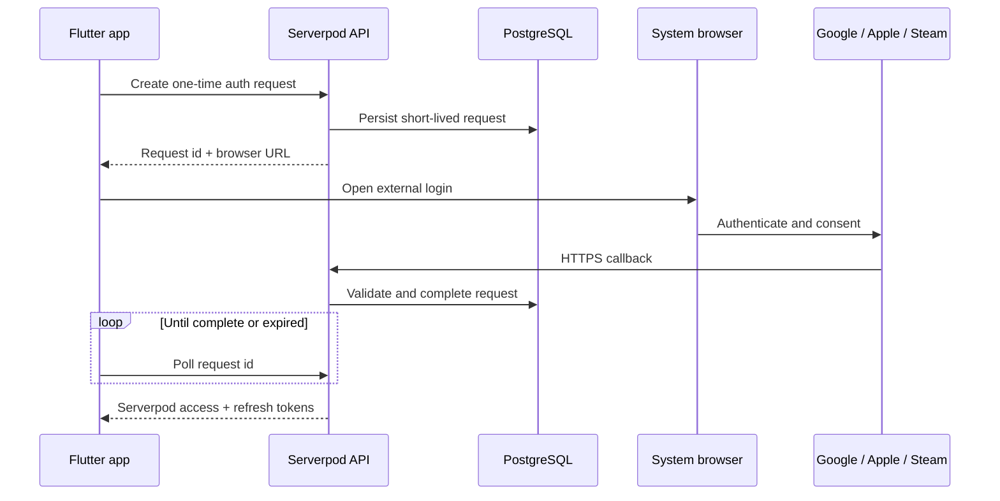

# Serverpod social authentication

The backend uses Serverpod Auth Core for sessions, Google and Apple through Serverpod Auth IDP, and Steam through an OpenID callback that issues the same Serverpod tokens.

Provider-console settings live outside the repository. Before release, verify callback URLs, client IDs, bundle identifiers, package names, signing fingerprints, and enabled capabilities against the current app configuration.



## Server configuration

Secrets are read from the environment; do not add a `passwords.yaml` or commit provider credentials.

Required groups:

- existing `SERVERPOD_PASSWORD_*` values for email/JWT sessions;
- `AONW_GOOGLE_CLIENT_SECRET_B64` for the Google web OAuth client JSON;
- `SERVERPOD_PASSWORD_googleDesktopRedirectUri` for external-browser desktop login;
- `SERVERPOD_PASSWORD_appleServiceIdentifier`, bundle/package identifiers, redirect URIs, team ID, and key ID;
- `AONW_APPLE_KEY_B64` for the Apple private key.

The server enables Google and Apple only when their required values are present, so email/password development can run without OAuth credentials.

Apply Serverpod migrations before testing shared social login. External-browser handoffs use short-lived, one-time request rows.

## Callback routes

| Provider | Server route |
| --- | --- |
| Google | `https://<api-host>/auth/google/callback` |
| Apple | `https://<api-host>/auth/apple/callback` |
| Steam | `https://<api-host>/auth/steam/callback` |

For production, these routes are served by `api.aonw.net`. Keep provider-console redirect lists and environment values identical.

## Google

1. Configure the consent screen and enable the People API.
2. Create one web/server OAuth client and register the server callback.
3. Create platform clients for Android and Apple platforms as required.
4. Register Android package `aonw.net.game` with the release signing fingerprint.
5. Register iOS/macOS bundle ID `aonw.net.game`.
6. Add every Flutter Web origin to the web client's authorized JavaScript origins.

Local Flutter Web uses the stable origin:

```text
http://localhost:7357
```

Android derives its platform identity from package name and signing key. Pass the web OAuth client as `GOOGLE_SERVER_CLIENT_ID`; do not pass the Android client as `GOOGLE_CLIENT_ID`.

Native iOS/macOS configuration remains in the platform `Info.plist` files and entitlements. Desktop browser login terminates at the server callback; provider tokens are not placed in a custom app URL.

## Apple

1. Enable Sign in with Apple for the app identifier.
2. Create a Services ID for web/Android flows.
3. Create and securely store the private key.
4. Register the HTTPS server callback.
5. Configure native iOS entitlement and the Android callback activity.

Apple web callbacks require HTTPS. Use a tunnel or development domain for local browser-flow testing.

Developer ID macOS builds distributed through Steam or itch use the external browser flow rather than the native App Store entitlement.

## Steam

Steam login uses external-browser OpenID and does not need an identity secret. The callback must be publicly reachable, and the migrations for Steam account and auth-request tables must be applied.

The client opens Steam in a browser and polls the server with a random one-time request ID. A completed request returns Serverpod session tokens, not the Steam provider token in the browser URL.

## Platform matrix

| Distribution | Google | Apple | Steam |
| --- | --- | --- | --- |
| Web | Web widget | Web flow | Browser popup and poll |
| iOS App Store | Native | Native | Hidden |
| Android | Native | Callback activity | Hidden |
| macOS Steam/itch | Native or browser adapter | Browser and poll | Browser and poll |
| Windows Steam/itch | Browser and poll | Browser and poll | Browser and poll |
| Linux Steam/itch | Browser and poll | Browser and poll | Browser and poll |

## Verification

For each enabled provider, test:

- new account creation and repeat login;
- cancelled or expired browser handoff;
- one-time request reuse rejection;
- JWT refresh after login;
- app restart with persisted session;
- wrong callback host or client ID failure;
- provider disabled when credentials are absent.

Relevant code is under `server/lib/src/auth/`, `lib/api/auth/`, and the platform configuration directories. Official setup guidance is linked from the Serverpod authentication documentation.
